# Meta 3.1: Elaborar servicios REST con nodejs y express

## Descripción del proyecto

Desarrollarás una API REST para gestionar un recurso de "Tareas" (tasks). La API
permitirá crear, leer, actualizar y eliminar tareas, utilizando únicamente una lista en
memoria como persistencia. La aplicación deberá organizarse siguiendo el patrón MVC
(Modelo-Vista-Controlador), donde:

- Modelo: Define la estructura de datos y la lógica de negocio

- Controlador: Maneja las peticiones HTTP y respuestas

- Rutas: Define los endpoints de la API

Nota: En una API REST, la "Vista" del MVC no existe como interfaz gráfica, sino que los
datos se devuelven en formato JSON.

## Estructura del proyecto

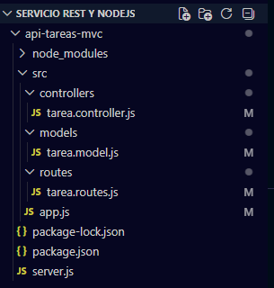

## Instrucciones de instalación (npm install)

1. Crear la carpeta del proyecto:

mkdir api-tareas-mvc

cd api-tareas-mvc

2. Inicializar el proyecto Node.js:

npm init -y

3. Instalar Express:

npm install express

4. Instalar nodemon como dependencia de desarrollo (para auto-reload):

npm install --save-dev nodemon

5. Configurar scripts en package.json:

"scripts": {
"start": "node server.js",
"dev": "nodemon server.js"
}

6. Crear la estructura de carpetas:

mkdir -p src/models src/controllers src/routes

## Cómo ejecutar (npm run dev)

Para iniciar el servidor:

npm run dev

Luego de ejecutar ese comando en la terminal, se mostrará el enlace del servidor
http://localhost:3000 y se podrán hacer las peticiones con cada endpoint, usando el
Postman.

Durante las peticiones, se debe tener abierto el servidor, para que se puedan hacer las
peticiones.

En el Postman se tendrán diferentes métodos para los endpoint, y en la parte para
poner URL se pondrá algo como esto: http://localhost:3000/api/tareas

Luego elegir el método que se quiere usar, y oprimir el botón send, para ver el
resultado.

## Lista de endpoints disponibles

| Metodo | Endpoint | Descripcion | Body (JSON)
| :--- | :---: | :---: | ---: |
| GET | /api/tareas  | Obtener todas | -
| GET | /api/tareas/1  | Obtener tarea ID=1 | -
| POST | /api/tareas | Crear tarea | {"titulo": "Nueva tarea", "completada": false}
| PUT | /api/tareas/1 | Actualizar completamente | {"titulo": "Tarea actualizada", "completada": true}
| PATCH | /api/tareas/1  | Actualizar parcialmente | {"completada": true}
| DELETE | /api/tareas/3  | Eliminar tarea  | -
| GET | /api/tareas//buscar?q=titulo| Obtener tarea por título | -
| GET | /api/tareas/buscar?q=titulo&formato=text| Obtener tarea por título y en modo texto | -
| GET | /api/tareas/?formato=text| Obtener todas y en modo texto | -

## Capturas de pantalla de las pruebas en Postman

Método GET con endpoint /api/tareas

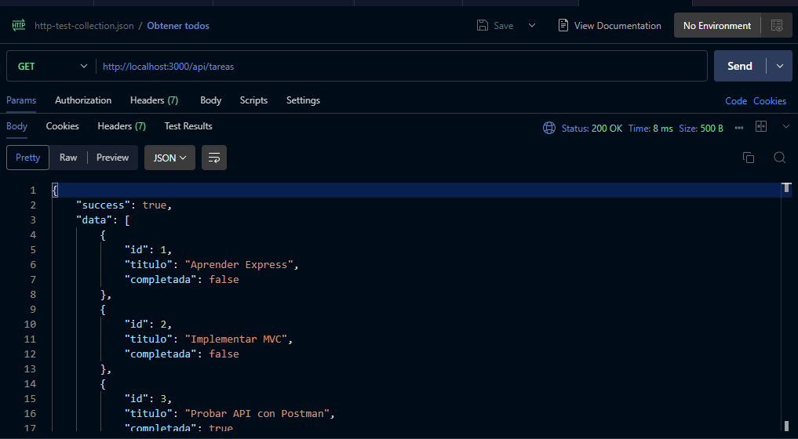

Método GET con endpoint /api/tareas/id
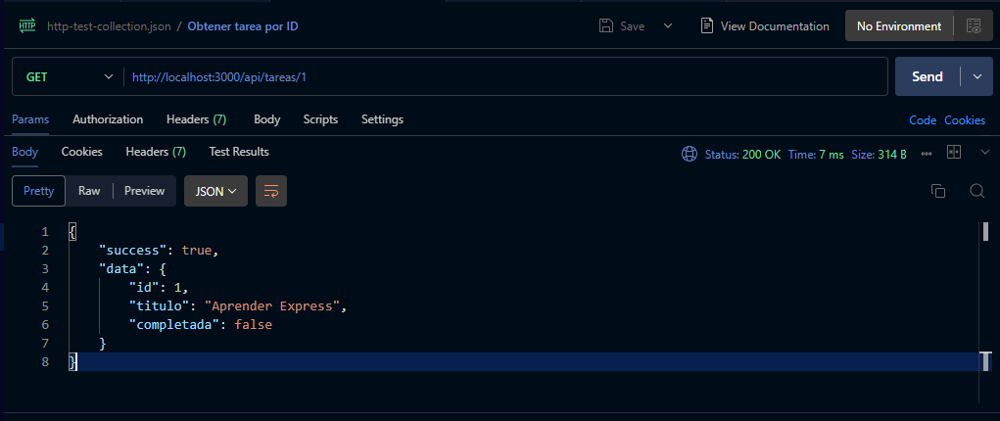

Método POST con endpoint /api/tareas
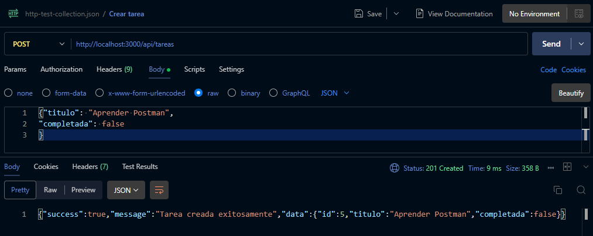

Método PUT con endpoint /api/tareas/id
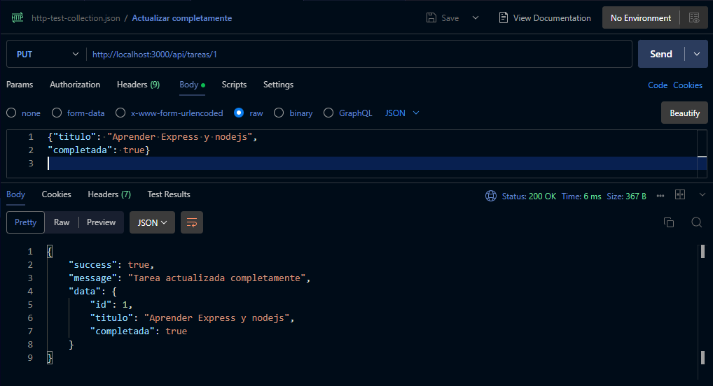

Método PATCH con endpoint /api/tareas/id
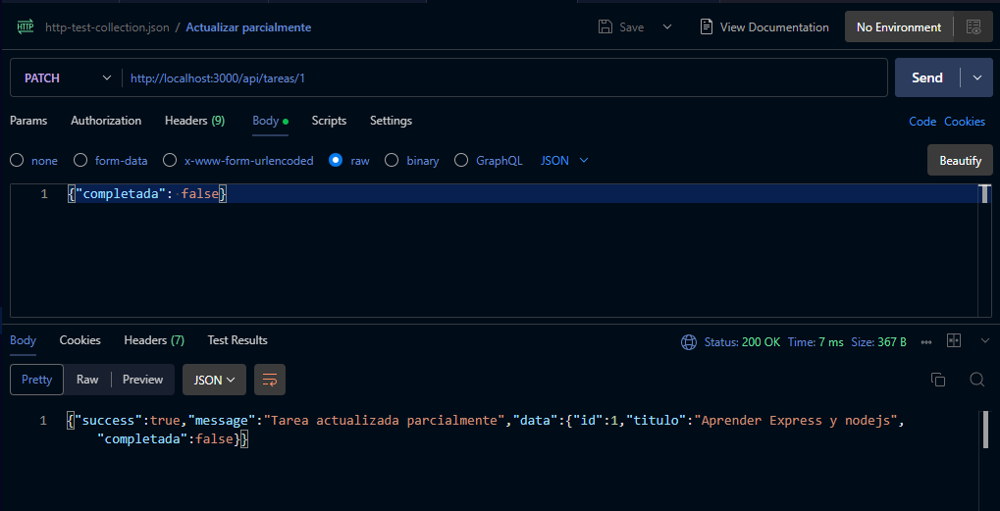

Método DELETE con endpoint /api/tareas/id
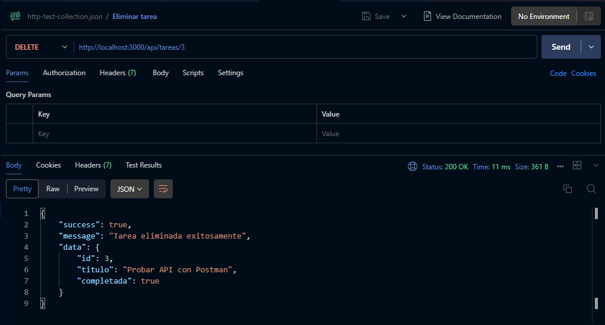

Método GET con endpoint /api/tareas/buscar?q=titulo
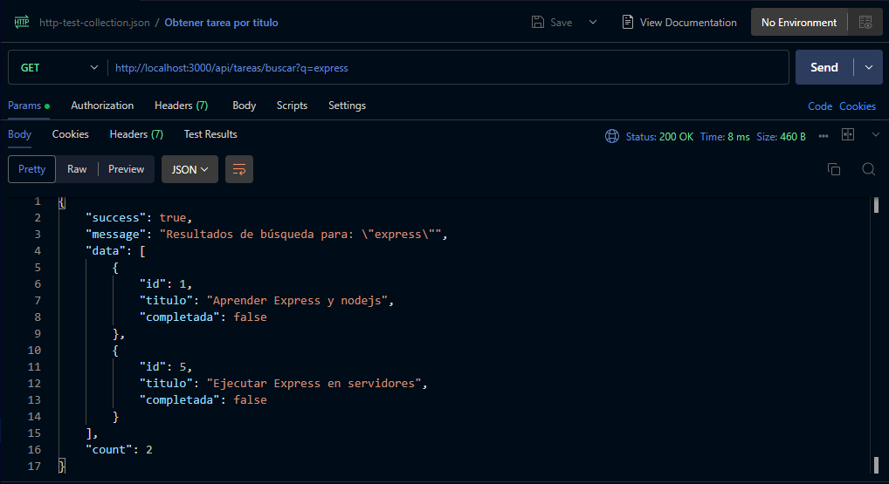

Método GET con endpoint /api/tareas/buscar?q=titulo&formato=text
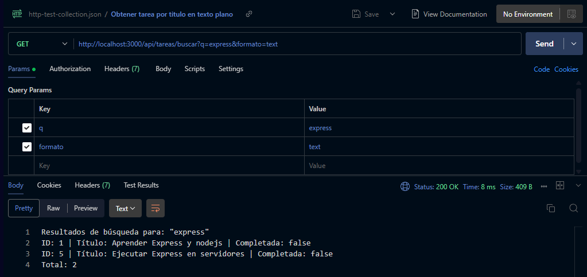

Petición incorrecta: Error de servidor
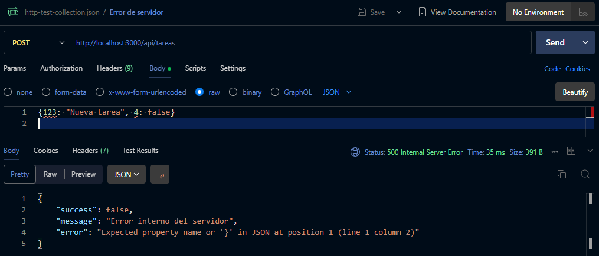

Petición incorrecta: Datos invalidos
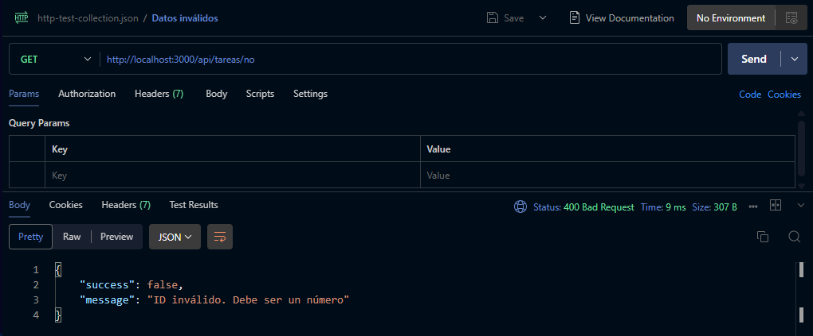

Petición incorrecta: Recurso no encontrado
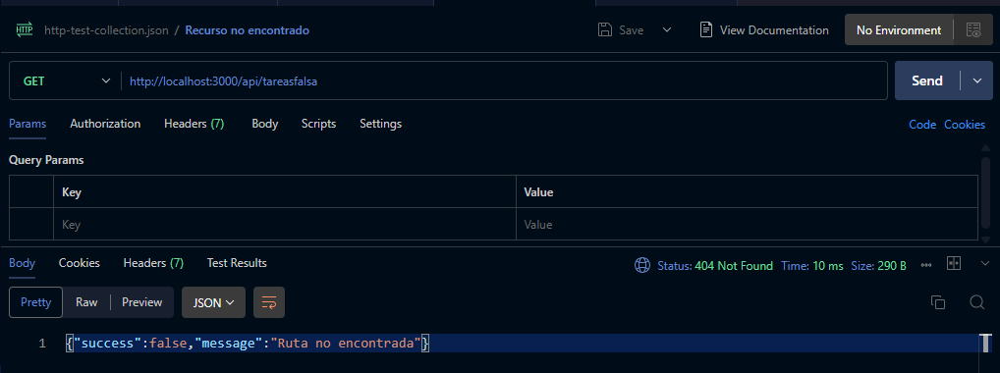

## Estructura MVC

### Modelo

La carpeta modelo contiene la lógica relacionada con los datos de la aplicación. El modelo se encarga de:

- Almacenar la lista de tareas
- Buscar tareas por ID
- Agregar nuevas tareas
- Actualizar tareas existentes
- Eliminar tareas
- Buscar tareas por título de forma parcial y sin distinguir mayúsculas/minúsculas

Básicamente se encarga de guardar los datos en un arreglo, y hacer las peticiones según el método que le llegue de manera que modifique el arreglo internamente.

### Controlador

La carpeta controlador contiene la lógica de negocio de la aplicación. El controlador recibe las peticiones HTTP desde las rutas, procesa la información, interactúa con el modelo y genera la respuesta correspondiente. El controlador se encarga de:

- Obtener todas las tareas
- Obtener una tarea por ID
- Crear una nueva tarea
- Actualizar una tarea completa (`PUT`)
- Actualizar parcialmente una tarea (`PATCH`)
- Eliminar una tarea (`DELETE`)
- Buscar tareas por título (`GET /api/tareas/buscar?q=...`)
- Devolver la respuesta en formato JSON o texto plano según el parámetro `?formato=json|text`

También maneja los errores como 400 y 404.

### Rutas

La carpeta routes define los endpoints de la API y conecta cada ruta con su controlador correspondiente. Las rutas funcionan como intermediarias entre las solicitudes del cliente y la lógica del controlador.

Ejemplos:

- GET /api/tareas
- GET /api/tareas/:id
- GET /api/tareas/buscar?q=express
- POST /api/tareas
- PUT /api/tareas/:id
- PATCH /api/tareas/:id
- DELETE /api/tareas/:id

### Vista

La “vista” se representa mediante las respuestas que recibe el cliente:

- **JSON** por defecto
- **Texto plano** cuando se usa el parámetro "?formato=text"

### Archivo principal de la aplicación

El archivo principal (por ejemplo "server.js" o "app.js") se encarga de:

- Crear la aplicación con Express
- Configurar middlewares como "express.json()"
- Registrar las rutas
- Iniciar el servidor en el puerto correspondiente

## Diferencia entre PUT y PATCH

El método PUT se encarga de hacer reemplazar por completo un objeto, y si ya existe el objeto, lo sobreescribe por completo.

El método PATCH se encarga de reemplazar una parte de un objeto, por lo que se puede dejar como esta una parte del objeto intacto, y la otra parte cambiada.

## Códigos de estado HTTP

### Estado 200
El código de estado 200 se utilizó para este proyecto, porque se encarga de mostrar cuando se realizó una petición correctamente, como mostrar algún dato, reemplazar completo o parcial de un dato especificado.

### Estado 201
El código de estado 201 se utilizó para este proyecto, porque se encarga de mostrar cuando se creó un nuevo dato y se agregó en la aplicación, con el método POST.

### Estado 400
El código de estado 400 se utilizó para este proyecto, cuando faltan datos requeridos, como cuando se ingresa el id incorrecto (el tipo de dato requerido) de un dato a mostrar, cuando no se pone un campo requerido para crear un objeto.

### Estado 404
El código de estado 401 se utilizó para este proyecto, cuando una tarea no existe, como cuando se quiere acceder un id que no existe en la aplicación.

### Estado 500
El código de estado 500 se utilizó para este proyecto, cuando falla el servidor completo, como cuando se quiere ingresar un nuevo dato, se ponga un atributo que no existe en el arreglo interno de la aplicación, cuando se ingresa mal los datos al crear un objeto.

